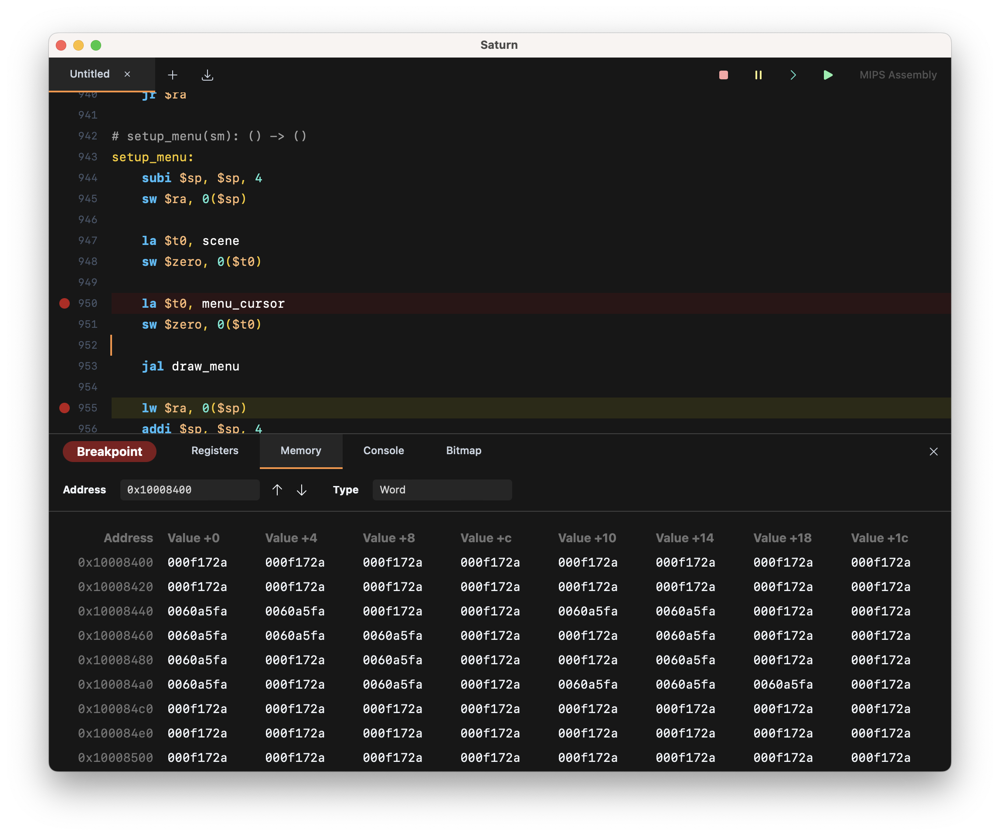

# Saturn - Modern MIPS Environment

Saturn is a development environment for educational learning with the MIPS processor architecture.

Saturn contains a custom-made editor, interpreter, debugger and assembler for MIPS code in order to deliver a solid and stable experience throughout.

# Project Goals
 - **Performance and Stability** - A fast environment that can keep up with all your use cases.
 - **Easy-to-use Tools** - Quick and simple interfaces that provide what you need at a glance.
 - **In-Place Debugging** - Set breakpoints and read values in-line with your source.

# Required Tasks
- [x] Basic Editor
- [x] Basic Interpreter
- [x] Basic Debugger
- [x] Basic Assembler
- [x] Syntax Highlighting
- [x] Bitmap Display
- [x] Console Events
- [x] Syscall Handling
- [x] Assembler Breakpoint Information
- [x] Compile Assembly In-Editor
- [x] Breakpoint Assembly In-Editor
- [x] Keyboard Input
- [x] File Loading

# Important Tasks
- [ ] Memory Editing and Copying
- [x] Register Editing and Copying
- [x] Finding Text (Cmd + F)
- [x] Finished Execution State
- [x] Editor Performance (Smooth Cmd + A @ 4000 lines)
- [ ] Floating Point Co-processor
- [x] MIDI and Other Syscalls
- [x] Variable Name Suggestions
- [x] Improve Bitmap Display
