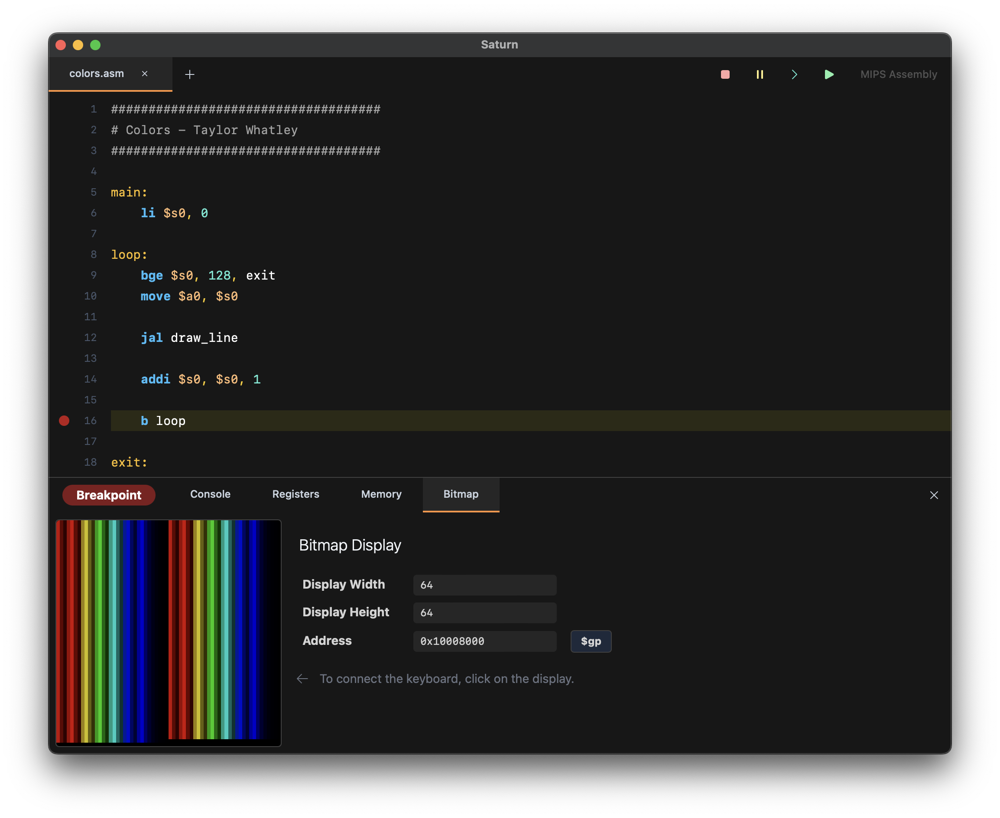
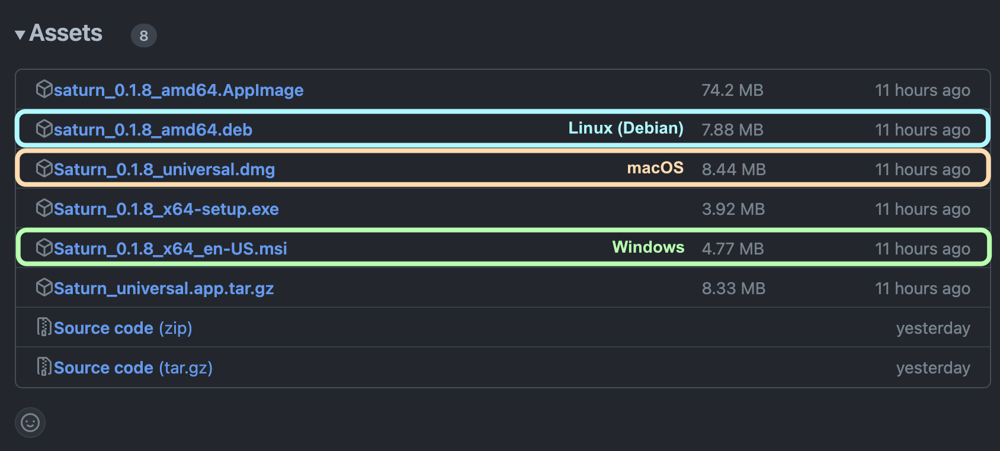

# Saturn - Modern MIPS Environment

Saturn is a development environment for educational learning with the MIPS processor architecture.

Saturn contains a custom-made editor, interpreter, debugger and assembler for MIPS code in order to deliver a solid and stable experience throughout.

# Project Goals

- **Performance and Stability** - A fast environment that can keep up with all your use cases.
- **Easy-to-use Tools** - Quick and simple interfaces that provide what you need at a glance.
- **In-Place Debugging** - Set breakpoints and read values in-line with your source.

# Installing

To install Saturn, visit the [releases](https://github.com/1whatleytay/saturn/releases) page.
There are usually two trains to pick from. If you're not sure, pick the **Latest** release.

| Train                                                                                 | Usage                                          |
|---------------------------------------------------------------------------------------|------------------------------------------------|
| [Latest](https://github.com/1whatleytay/saturn/releases/latest) v0.1.9                | Stable, complete release for most users.       |
| [Pre-Release](https://github.com/1whatleytay/saturn/releases/tag/app-v0.1.10) v0.1.10 | Latest experimental features. Sometimes buggy. |

Trying out the pre-release versions of Saturn helps the project out.
If you encounter an issue, please [file a bug](https://github.com/1whatleytay/saturn/issues/new).
We appreciate every report we can get.

Under the releases page, select the release you want to download and open Assets, 

 - On **Windows**, select the file ending in `.msi`.
 - On **macOS**, select the file ending in `.dmg`.
 - On **Linux**, select either `.deb` (for Debian supporting distros) or `.AppImage`.

Then follow the instructions in the installer. Once the installer finishes, Saturn should be installed on your system.

# Building

For instructions on building Saturn from source, see [BUILD.md](BUILD.md).
Typically, you'd want to build Saturn from source if you're trying to develop, add features, or support a new platform.
Otherwise, you should see the Installation section to install a prebuilt binary.
