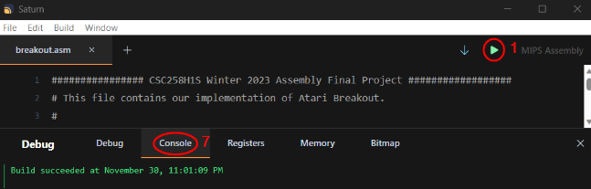
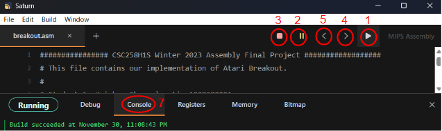
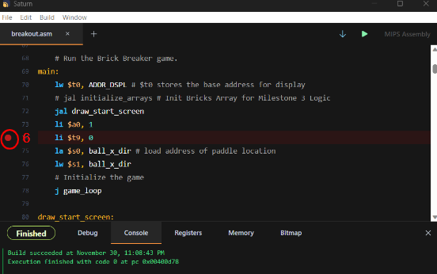

# Saturn Core Functionality

## Introduction

This document provides an overview of several different important buttons in Saturn.

## Functionality

*Figure 1: Saturn Components labeled before the play button is pressed*

*Figure 2: Saturn Components labeled before the play button is pressed*

### 1. Play

The Play functionality allows you to run a program or execute a specific code snippet. By clicking the Play button, you can start the execution of your code and see the output or behavior of your program. Note that the play button will only execute code up until the first breakpoint is encountered. At this point, program execution will automatically pause. Pressing the play button again will continue program execution after this breakpoint.

### 2. Pause

The Pause functionality allows you to temporarily halt the execution of a running program. It is useful when you want to pause the program's execution to inspect variables or debug an issue.

### 3. Stop

The Stop functionality allows you to terminate the execution of a running program. Clicking the Stop button will immediately halt the program's execution and return you to the code editor.

### 4. Step

The Step functionality allows you to execute your code one line at a time. By clicking the Step button, you can move forward through your code, observing the changes and behavior of your program at each step.

### 5. Backstep

The Backstep functionality allows you to reverse the execution of your code one line at a time. By clicking the Backstep button, you can move backward through your code, undoing the changes and reverting the behavior of your program at each step.

### 6. Breakpoint

The Breakpoint functionality allows you to set a marker in your code for debugging purposes. By setting a breakpoint, you can pause the execution of your program at a specific line, allowing you to inspect variables, evaluate expressions, and analyze the state of your program at that point. The breakpoint can be set by clicking on the left side of a line of code. A red dot should appear when you successfully add a breakpoint to a line (see the image below).

*Figure 3: This image shows an example of what Saturn might look like after a breakpoint has been added. In this case, a breakpoint was added to line 74.*

## 7. The Console Tab

In MIPS Assembly, you can print values using the following methods:

1. **Print Integer**: To print an integer value, you can use the `li` (load immediate) instruction to load the value into the register `a0`, and then use the `add` instruction with register `v0` to ensure this register has the value 1 (for system call number 1). Then, include the `syscall` instruction immediately afterwards.

2. **Print String**: To print a string, you can load the address of the string into the register `a0` (argument register) using the `la` (load address) instruction, and then use the `add` instruction with register `v0` to ensure this register has the value 4 (for system call number 4). Then, include the `syscall` instruction immediately afterwards.

3. **Print Character**: To print a single ASCII character, you can load the address of the character into the register `a0` (argument register) using the `la` (load address) instruction, and then use the `add` instruction with register `v0` to ensure this register has the value 11 (for system call number 11). Then, include the `syscall` instruction immediately afterwards.

4. **Print Hexadecimal**: To print an integer in hexidecimal, you can use the `li` (load immediate) instruction to load the value into the register `a0`, and then use the `add` instruction with register `v0` to ensure this register has the value 34 (for system call number 34). Then, include the `syscall` instruction immediately afterwards.

To find more information about the system calls, you can refer to the MIPS system call documentation at https://courses.missouristate.edu/kenvollmar/mars/help/syscallhelp.html.